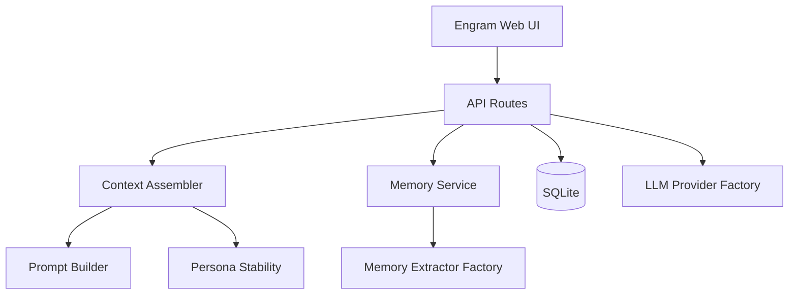

# Engram — Phase 1 架构说明

> **产品名**：Engram  
> **版本**：Phase 1（海外 Web 纯文字角色扮演，无语音 / 生图 / 社交流）  
> **目标读者**：产品负责人  
> **技术栈**：Next.js、TypeScript、Tailwind、shadcn/ui、本地 SQLite

---

## 1. 产品范围与原则

Engram 交付一条可完整演示的「创建角色 → 对话 → 记忆沉淀 → 上下文可观测」闭环。所有送入模型的上下文必须由**显式模块**组装，禁止在 API 路由内散落模板字符串。

核心原则：

- **人设稳定优先**：长对话中人设前缀与边界不可被裁剪；至少保留一条示例对话锚点。
- **记忆可管可控**：用户可编辑 / 删除；已删除记忆永不回流。
- **可观测**：每轮可在 Context Inspector 中看到分层内容与裁剪结果。
- **无密钥可演示**：未配置 LLM 时，脚本化 Provider 仍驱动完整 UI 与数据路径。

---

## 2. 模块地图（Module Map）

| 路径 | 职责 |
|------|------|
| `src/app/` | 页面与 API Routes（角色 CRUD、聊天流式、记忆 API） |
| `src/lib/persona/` | 角色卡类型、稳定人设正文、输出形态常量 |
| `src/lib/prompt/` | 版本化 Prompt 模板与 `buildPromptSections` |
| `src/lib/context/` | Token 估算、`assembleContext`（分层、裁剪、`evictedTurns`） |
| `src/lib/memory/` | 记忆类型、排序、槽位、取代、提取器、服务 |
| `src/lib/llm/` | `LLMProvider` 接口、OpenAI 兼容实现、脚本化实现、`createLLMProvider` |
| `src/lib/db/` | SQLite 迁移、CRUD、种子角色 |
| `src/lib/chat/` | `runChatTurn` 编排、滚动摘要格式化 |
| `src/components/` | 角色表单、Context Inspector、Memory Panel |

**请求主路径（聊天）**：

```
UI → POST /api/chat/[id]/stream
  → insertMessage(user)
  → assembleContext → createLLMProvider().streamChat
  → insertMessage(assistant)
  → memoryService.processAssistantTurn
  → appendToSummary(evictedTurns only)
```

---

## 3. 数据模型（Data Model）

SQLite 文件：`data/roleplay.db`（`userId` 固定为 `local`，无鉴权）。

### 3.1 `characters`

角色卡：`name`, `tagline`, `description`, `personality`, `scenario`, `example_dialogues`（JSON 数组）, `greeting`, `speech_style`, `boundaries`, 时间戳。

### 3.2 `chat_sessions`

`(character_id, user_id)` 唯一，一会话一行。

### 3.3 `messages`

`session_id`, `role`（`user` | `assistant`）, `content`, `created_at`。

### 3.4 `session_summaries`

`session_id` → `summary_text`（滚动摘要，仅追加 **被挤出 verbatim 窗口** 的 turn 原文）。

### 3.5 `memories`

| 字段 | 说明 |
|------|------|
| `type` | `fact` \| `relationship` \| `promise` \| `boundary` \| `plot` |
| `text` | 可读记忆正文 |
| `salience` | 0–1，检索权重 |
| `slot` | 可选单值槽（见 §4.3） |
| `source_turn_id` | 写入来源消息 |
| `superseded_by_id` | 被新记忆取代时指向新 id |
| `deleted_at` | 软删 |

---

## 4. 角色与人设（Persona）

### 4.1 角色卡字段

见 Phase 1 产品：`name`, `tagline`, `description`, `personality`, `scenario`, `exampleDialogues`, `greeting`, `speechStyle`, `boundaries`。

### 4.2 反漂移

- 稳定 L0：身份 + 边界 + ≥1 示例对话 + 输出形态（`*动作*` + 台词）
- Re-anchor 短提醒；禁止「通用助手」口吻
- 裁剪时 **永不** 丢弃 L0 核心人设与 `boundaries`

实现：`src/lib/persona/stability.ts`，由 `src/lib/context/assembler.ts` 调用。

---

## 5. 记忆（Memory）

### 5.1 写入

每轮助手消息完成后，`MemoryService` 调用 `createMemoryExtractor()`：

- **无 `LLM_API_KEY`**：`DeterministicMemoryExtractor`（规则 / 关键词）
- **有 Key**：`LLMMemoryExtractor`（OpenAI 兼容 JSON）

### 5.2 读取

`rankMemories`：salience + recency + 词面相关度 → 在记忆层 token 预算内 `packMemoriesByTokenBudget`。

### 5.3 记忆槽位（Memory Slots）

**同类型多条记忆可以并存**（多个 fact、promise、plot 等）。**取代**仅当：

1. 候选带 `supersedesMemoryId`；或  
2. 与某条活跃记忆 **同一 `slot`**

Phase 1 内置槽位（`src/lib/memory/slots.ts`）：

| `slot` | 含义 |
|--------|------|
| `user_name` | 用户姓名（全局仅一条活跃） |

槽位解析：`inferMemorySlot(type, text)`；写入时持久化到 `memories.slot`。

### 5.4 如何新增一个记忆槽位

1. 在 `src/lib/memory/slots.ts` 的 `MEMORY_SLOTS` 增加常量（如 `USER_CITY: "user_city"`）。
2. 在 `inferMemorySlot()` 中为对应 `type` + 文本模式返回新槽位（或让 LLM / 规则提取器在 `MemoryCandidate.slot` 中显式赋值）。
3. 在 `findSupersededMemory()` 中已按 `slot` 匹配，无需改取代逻辑。
4. 为提取器（确定性或 LLM prompt）补充该槽位的生成规则。
5. 增加单元测试：同槽两条应取代；不同槽或无关 fact 应并存。

---

## 6. Prompt 工程

模块：`src/lib/prompt/`（`PROMPT_VERSION`, `PROMPT_SECTION_ORDER`）。

- 人设块、记忆块、摘要块、重锚、生成提示 — 顺序由测试锁定（`builder.test.ts`）。
- API Route **不得**内联大段 system 模板。

---

## 7. 上下文分层与裁剪（Context Layers & Trim Order）

### 7.1 层（自外向内注入 system，再 verbatim turns）

| 层 ID | 内容 | 裁剪优先级 |
|-------|------|------------|
| persona | 稳定人设 + 边界 + 示例 + 输出形态 | **最后**（仅可减少示例条数，≥1） |
| memories | 检索到的记忆列表 | 低分记忆可丢 |
| summary | 滚动摘要 | 可截断 |
| recent | 最近 turn 原文 | **最先**丢最旧 pair |
| reanchor | 短重锚 | 不丢 |
| hint | 生成提示 | 不丢 |

默认总预算：`DEFAULT_CONTEXT_TOKEN_BUDGET`（4096）；估算：`ceil(chars/4)`。

### 7.2 超预算裁剪顺序（Trim Order）

1. 移除最旧 verbatim turn pair → 记入 **`evictedTurns`**
2. 缩短 rolling summary
3. 减少装入上下文的记忆条数
4. 减少示例对话条数（仍 ≥1）
5. **永不丢弃**：人设核心、`boundaries`、reanchor、hint

### 7.3 滚动摘要

仅当 `evictedTurns.length > 0` 时，`formatEvictedTurnsForSummary` 追加到 `session_summaries` — **不使用** `trimLog` 或任意 history 切片。

实现：`src/lib/context/assembler.ts`，`src/lib/chat/summary.ts`，`orchestrator` / stream route。

---

## 8. LLM 接入与扩展

### 8.1 环境变量

| 变量 | 默认 |
|------|------|
| `LLM_API_KEY` | 空 → 脚本化 Provider |
| `LLM_BASE_URL` | `https://api.openai.com/v1` |
| `LLM_MODEL` | `gpt-4o-mini` |

### 8.2 现有实现

- 接口：`src/lib/llm/provider.ts` — `streamChat(messages, onChunk) => fullText`
- 工厂：`createLLMProvider()` — 有 Key 用 `OpenAICompatibleProvider`，否则 `ScriptedLLMProvider`

### 8.3 如何新增一个 LLM Provider

1. 在 `src/lib/llm/` 新建类，实现 `LLMProvider`（`name` + `streamChat`）。
2. 在 `src/lib/llm/factory.ts` 中按环境变量或配置分支（例如 `LLM_PROVIDER=anthropic`）实例化该类。
3. 若 API 非 OpenAI 兼容，在 Provider 内将 `assembleContext` 产出的 `messages` 映射为目标 API 格式。
4. 聊天与记忆提取共用 `getLLMConfig()`；记忆提取单独走 `createMemoryExtractor()`，可复用同一 Key。

**注意**：Phase 1 不要求多 Provider 并存；扩展时保持无 Key 时脚本化路径可用。

---

## 9. 前端（Phase 1）

- 英文 UI；产品名 **Engram**
- 首页：角色库；聊天页：流式消息 + Context / Memory（桌面侧栏，移动 Tab）
- 种子 3 角色：Lyra、Zero、Mara

---

## 10. Phase 1 明确不包含

- 用户注册 / 登录、多租户、云同步  
- **语音**、**图片生成**、角色立绘  
- **社交动态**、关注、公开广场  
- 原生 iOS / Android  
- 向量库 / Embedding 检索（仅词面相关度）  
- 多人 / 群聊  
- 付费、模型路由、中心化内容审核管线（仅角色卡 `boundaries` 约束模型）

---

## 11. 测试

```bash
npm test
```

覆盖：`context/assembler`（裁剪、persona 保留、`evictedTurns`）、`memory/rank` & `supersede`、`prompt/builder`。

---

## 12. 模块依赖（简图）



---

## 13. Phase 1 成功标准

1. 无 API Key 可完成对话并查看 Inspector 各层。  
2. 有 Key 时走真实流式模型与 LLM 记忆提取。  
3. 记忆可增删改，下轮检索与 Inspector 一致。  
4. 长历史单测证明 persona 层仍在；`evictedTurns` 正确驱动摘要。

---

*仓库 canonical 路径：`docs/architecture.md`*
