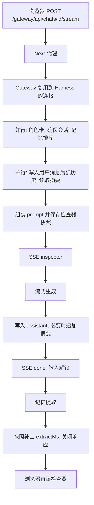
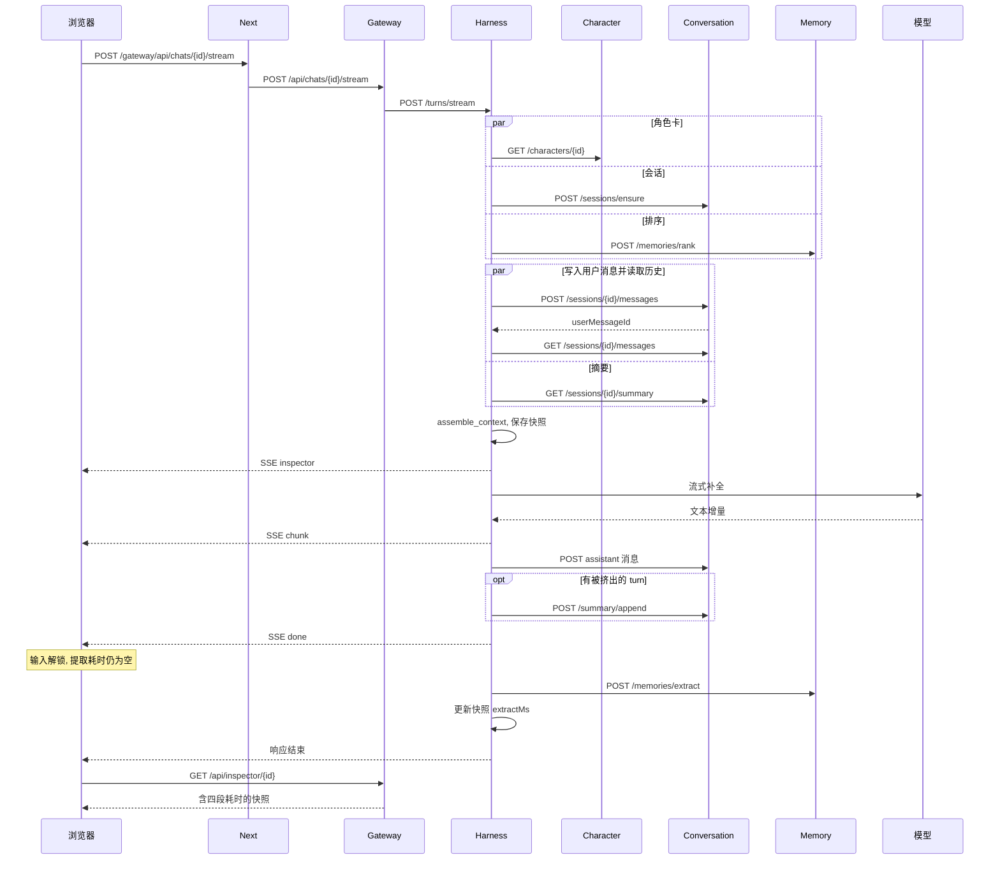

# 一轮聊天的执行过程

本文描述浏览器发出一条消息之后，请求如何穿过 Web、chat-service 和 context-service，以及回复、记忆、耗时分别在什么时候对用户可见。服务边界以 [architecture.md](architecture.md) 为准。

文中若仍出现 Gateway，指 chat-service 的对外 HTTP。Harness 指 context-service。角色卡由 chat 本地读出后随 `StreamTurn` 传入，context 不再单独请求角色服务。记忆提取在 SSE `done` 之后写入 `memory.extract` 队列，由 memory-service 消费，完成后再回写检查器的 `extractMs`。

Phase 1 里，用户等的是模型。编排本身是几次内部 HTTP 和一次本地组装。下面四件事压的是这段可压缩的时间，以及回复已经生成之后还挡在界面前面的工作：

1. 首字前，彼此独立的内部读取并行执行。
2. 记忆提取放在 SSE `done` 之后。浏览器收到 `done` 就可以输入下一条。
3. 这一跳上的 HTTP 客户端在进程内复用，不再每轮新建。
4. 每一轮记下四段耗时：编排、模型首字、模型生成、记忆提取。

## 1. 谁持有连接

| 进程 | 客户端 | 连向 | 生命周期 |
|------|--------|------|----------|
| Gateway | `app.state.http` | Harness 的 `/turns/stream` | 进程启动到关闭。流式响应结束时只关闭这一次响应，不关闭客户端 |
| Harness | `app.state.http` | Character、Conversation、Memory | 同上。`/turns/stream` 把这一个客户端传进整轮 |
| Harness | `app.state.llm` | OpenRouter | 有密钥时，聊天补全复用这条连接 |
| Memory | 模块内一个客户端 | OpenRouter | 有密钥时，提取复用这条连接。进程关闭时关掉 |

没有密钥时，聊天走脚本化 Provider，提取走确定性提取器，这两条模型连接不会被创建。

Gateway 上角色列表、记忆编辑这类短请求仍是各自打开客户端。它们不在首字路径上。

## 2. `chat` 的阶段

入口是 `POST /gateway/api/chats/{characterId}/stream`，正文 `{ "message": "..." }`。Next 的 Route Handler 把 `/gateway/*` 原样转给 Gateway，Gateway 再把 Harness 的 SSE 字节转给浏览器。

### 2.1 首字之前

空消息在任何网络请求之前就返回 400。

然后三件互不依赖的事一起发出：

- `GET /characters/{id}`
- `POST /sessions/ensure`
- `POST /memories/rank`，query 就是这条用户文本

其中任何一个失败，其余未完成的请求会被取消，错误在 SSE 开始之前以 JSON 返回。角色不存在时，ensure 可能已经为这个 id 留下一行空会话；ensure 按 `(character_id, user_id)` 取或建，重复 404 不会再插一行。

会话 id 到手之后，摘要读取立刻开始。与此同时写入用户消息，写完再读历史，并去掉刚写入的那条，使它只作为「最新用户行」进入 prompt，不进入可裁剪的 verbatim 窗口。摘要若还没回来，会和读历史重叠，组装前再汇合。

本地 `assemble_context` 做人设、记忆装箱、摘要、最近 turn、re-anchor 和生成提示，超预算时按架构文档第 7 节裁剪。快照写入 `engram_context.inspections`，随后推出 `inspector` 事件。这一事件里还没有耗时。

### 2.2 模型

`model_started` 记在模型迭代开始的时刻，也就是 `inspector` 已经被调用方取走之后。因此 `orchestrationMs` 含两次含义：服务端预取和组装，加上把 `inspector` 交到调用方手上的等待。

脚本化 Provider 或 OpenRouter 的每个文本增量变成一条 `chunk`。第一个增量的时刻是 `modelFirstTokenMs` 的终点，流结束的时刻是 `modelTotalMs` 的终点。两者都从 `model_started` 起算。

发给 OpenRouter 的流式请求带 `Accept-Encoding: identity` 和 `Accept: text/event-stream`，并要求按延迟选择端点。gzip 会把整段 SSE 攒到生成结束才解开，首字就会和全文同时到达。Gateway 向 Harness 拉流时同样不要压缩。Next 代理加上 `Cache-Control: no-transform` 和 `X-Accel-Buffering: no`，避免浏览器前再缓冲一次。

### 2.3 落库，然后 `done`

流结束后：

1. 把 assistant 正文写入 Conversation。
2. 若有被挤出的 turn，把它们的原文追加进滚动摘要。摘要只吃 `evictedTurns`。
3. 把当时已知的耗时写入快照。`extractMs` 为 `null`。
4. 推出 `done`。

`done` 里带有 `messageId`、完整正文、`sessionId`、`provider` 和 `timings`。浏览器用它替换占位气泡，并立刻解除输入锁定。

### 2.4 `done` 之后

同一条 HTTP 响应还没有关。Harness 调用 `POST /memories/extract`，记下 `extractMs`，再更新同一条检查器快照并打一条日志：

```text
turn timings mode=chat character=…ms session=…ms rank=…ms prefetch=…ms ... extract=…ms
```

提取的 HTTP 失败只记日志，不另发 SSE。快照更新失败同样只记日志。响应随后关闭。

浏览器读完响应体之后，如果用户还没有开始更新的一轮，会再请求一次检查器。上下文面板这时才显示出提取耗时。若用户已经发出下一条，这次补读会被丢掉，避免用旧快照盖住新的一轮。

下一条的排序有可能赶在提取写完之前。那一轮看不到刚刚这条对白产生的记忆；再下一条会看到。

## 3. 总流程



## 4. `chat` 时序



历史读取发生在用户消息写入之后。摘要读取从会话 id 确定就开始，所以它既可以盖住写入，也可以盖住随后的读历史。图里把它们画在同一个并行段，表示这段时间里两路都在飞，不是摘要必须等历史。

## 5. `regenerate` 和 `continue`

这两种模式没有一条可以提前拿去排序的用户文本，所以排序不能和角色卡同时开始。

并行的是角色卡和 `sessions/ensure`。会话 id 确定后，摘要读取和历史读取并行。历史到了才知道 rank query，再和仍未完成的摘要读取一起等待。

`regenerate` 不写新的用户消息。最后一条必须是 assistant。若前一条也是 assistant，prompt 保留那条更早的回复，只替换最后一条，发给模型的最新用户行是续写指令。否则 verbatim 截到最后一条用户消息之前。生成结束后，Conversation 在一个事务里写入新回复并删除旧回复。事务失败则旧回复还在，并且不会清除记忆、不会提取。事务成功后、`done` 之前，按旧回复的 id 软删 `source_turn_id` 相符的记忆。这一步失败则发 `error`，不提取。

`continue` 不把续写指令写入会话，也不把该指令交给提取。verbatim 是全部历史。发给模型的最后一条用户消息是续写指令，且不进入可裁剪窗口。排序 query 用上一条真实用户文本。新回复另存一条 assistant。

两种模式在落库和 `done` 之后的提取、耗时回写，与 `chat` 相同。

## 6. 耗时字段

| 字段 | 起 | 止 | `done` 事件 | 结束后的快照 |
|------|----|----|-------------|--------------|
| `orchestrationMs` | 进入 `stream_turn` | 模型迭代开始 | 有 | 有 |
| `modelFirstTokenMs` | 模型迭代开始 | 第一个文本增量 | 有；没有增量时为 `null` | 同左 |
| `modelTotalMs` | 模型迭代开始 | 流结束 | 有；没有开始模型时为 `null` | 同左 |
| `extractMs` | 提取请求开始 | 提取请求结束 | `null` | 有；失败或未提取时保持 `null` |

`stages` 是同一轮里每个已执行阶段的自身耗时，按固定顺序排列。并行的角色卡、会话、排序各自记自己的时间，`prefetch` 是这三路的墙钟。`contextLoad` 是会话确定之后、摘要与写入或读历史重叠那一段的墙钟。没走到的阶段不出现。`done` 事件里的 `stages` 还没有 `extract`；快照更新后才补上。

上下文面板按 `stages` 逐行列出。Gateway 另记一条日志：`headers_ms` 是 Harness 返回响应头的时间，`first_byte_ms` 是第一段 SSE 字节，`total_ms` 是整段流结束，其中包含 `done` 之后的提取。

生成失败、空回复、替换失败、清除记忆失败，都不会提取。能记下的耗时会放进 `error` 事件和已有的快照。`error` 不解锁成成功回复；前端仍按失败重载已落库的记录。

## 7. 失败时停在哪里

| 时机 | 客户端看到的 | 提取 |
|------|----------------|------|
| 首字前，角色不存在或上游 4xx/5xx | JSON 错误，不是 SSE | 不提取 |
| 模型流失败或空回复 | SSE `error` | 不提取 |
| assistant 尚未写成功 | SSE `error`，旧回复还在 | 不提取 |
| regenerate 的记忆清除失败 | SSE `error`，新回复已在 | 不提取 |
| `done` 已发出，提取或回写失败 | 仍然只有 `done` | 提取失败被吞掉；回写失败只记日志 |

## 8. 代码位置

| 行为 | 位置 |
|------|------|
| 并行预取、`done` 之后入队、耗时 | `services/context/context_service/orchestrator.py` |
| 模型调用与失败切换 | `services/llm_gateway/llm_gateway_service/router.py` |
| 快照回写 | `services/context/context_service/inspections.py` |
| chat 到 context 的流 | `services/chat/chat_service/main.py` 的 `_proxy_turn` |
| 提取连接复用 | `services/memory/memory_service/domain/extractor.py` |
| 收到 `done` 解锁，响应结束后补读检查器 | `web/src/components/chat-panel.tsx` |
| 四段耗时的展示 | `web/src/components/insight-sheets.tsx` |
