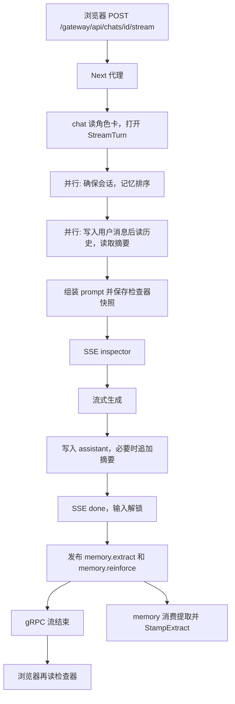
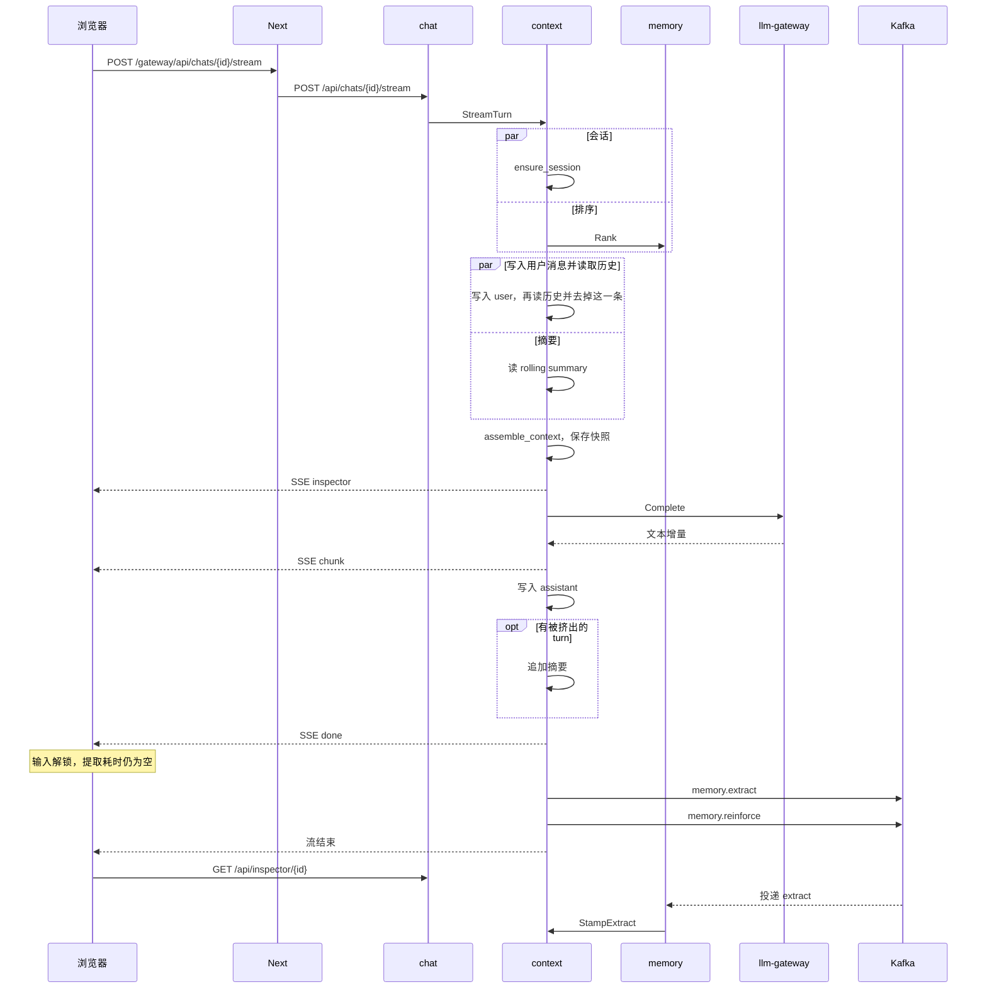

# 一轮聊天的执行过程

本文描述浏览器发出一条消息之后，请求如何穿过 Web、chat-service 和 context-service，以及回复、记忆、耗时分别在什么时候对用户可见。服务边界以 [architecture.md](architecture.md) 为准。队列的主题、重试和死信以 [queue.md](queue.md) 为准。

浏览器只和 chat-service 说话。Web 把 `/gateway/*` 原样代理到 chat。chat 再通过 gRPC 调用 context。context 持有这一轮的编排：会话、排序、组装、模型、落库，以及 `done` 之后的两次 Kafka 发布。记忆提取不在这条流里面执行。memory-service 稍后消费 `memory.extract`，完成后再调用 context 的 `StampExtract`，检查器快照才补上 `extractMs`。

用户等的是模型。编排本身是几次内部 gRPC 和一次本地组装。下面四件事决定这段时间里什么可以并行，以及回复已经生成之后还有什么不该再挡住输入框：

1. 首字前，彼此独立的内部读取并行执行。
2. 记忆提取放在 SSE `done` 之后，并且不在 chat 的响应里等待它结束。浏览器收到 `done` 就可以输入下一条。
3. chat 到 context、context 到 memory、context 到 llm-gateway 的 gRPC 通道在进程内复用。
4. 每一轮记下四段耗时：编排、模型首字、模型生成、记忆提取。前三段在 `done` 里就有。提取耗时要等消费者回写。

## 1. 谁持有连接

| 进程 | 客户端 | 连向 | 生命周期 |
|------|--------|------|----------|
| Web | Next 的 Route Handler | chat 的 HTTP | 这一次浏览器请求 |
| chat | `app.state.context` | context 的 gRPC | 进程启动到关闭。流结束只结束这一次 RPC，不关闭通道 |
| context | memory stub | memory 的 `Rank`、`DiscardTurn` | 同上 |
| context | llm stub | llm-gateway 的 `Complete` | 同上 |
| context | Kafka 生产者 | `memory.extract`、`memory.reinforce` | 第一次发布时建立，进程内复用 |
| memory | Kafka 消费者 | 消费组 `engram-memory` | 进程启动后一直轮询 |
| memory | context stub | `StampExtract` | 每次回写打开一条通道，用完关闭 |
| llm-gateway | HTTP | OpenRouter | 有密钥时复用。没有密钥时不创建 |

没有密钥时，聊天走脚本化 Provider，提取走确定性提取器。这两条模型连接不会被创建，Kafka 发布和消费照常发生。

角色列表、记忆编辑这类短请求各自走一元 RPC。它们不在首字路径上。

## 2. `chat` 的阶段

入口是 `POST /gateway/api/chats/{characterId}/stream`，正文 `{ "message": "..." }`。Next 把路径转到 chat 的 `POST /api/chats/{characterId}/stream`。chat 读本地角色卡，把角色卡 JSON、用户 id、模式和文本交给 context 的 `StreamTurn`，再把返回的 SSE 字节转给浏览器。

响应头带 `Cache-Control: no-cache`、`Connection: keep-alive` 和 `X-Accel-Buffering: no`，避免代理把整段流缓冲到结束。发给模型的流式请求另带 `Accept: text/event-stream` 和 `Accept-Encoding: identity`。gzip 会把 SSE 攒到生成结束才解开，首字就会和全文同时到达。

### 2.1 首字之前

空消息在任何网络请求之前就由 context 返回 400。chat 把它变成 JSON，而不是 SSE。

然后两件互不依赖的事一起发出：

- `ensure_session`：按 `(character_id, user_id)` 取或建会话
- `Rank`：query 就是这条用户文本

会话失败时，排序任务会被取消。角色不存在是 chat 在调用 context 之前就返回的 404，不会留下会话。

会话 id 到手之后，摘要读取立刻开始。与此同时写入用户消息，写完再读历史，并去掉刚写入的那条，使它只作为「最新用户行」进入 prompt，不进入可裁剪的 verbatim 窗口。摘要若还没回来，会和读历史重叠，组装前再汇合。`prefetch` 是会话与排序这一段的墙钟。`contextLoad` 是会话确定之后、写入和读历史与摘要重叠的墙钟。

本地 `assemble_context` 做人设、记忆装箱、摘要、最近 turn、re-anchor 和生成提示，超预算时按架构文档第 7 节裁剪。快照写入 `engram_context.inspections`，随后推出 `inspector` 事件。这一事件里还没有耗时。快照是这一轮发给模型的打包结果，不是第二份聊天记录。

### 2.2 模型

`model_started` 记在模型迭代开始的时刻，也就是 `inspector` 已经被调用方取走之后。因此 `orchestrationMs` 含两段：服务端预取和组装，加上把 `inspector` 交到调用方手上的等待。

脚本化 Provider 或 OpenRouter 的每个文本增量变成一条 `chunk`。第一个增量的时刻是 `modelFirstTokenMs` 的终点，流结束的时刻是 `modelTotalMs` 的终点。两者都从 `model_started` 起算。没有增量时，首字耗时是 `null`。

会话钉是 `(provider, model)`，默认 `openrouter` 和 `anthropic/claude-sonnet-5`。无密钥时网关不改这颗钉，直接走脚本化 Provider。有密钥且还没有吐出第一个 token 时，网关可以整轮换备用链上的下一家。已经有 token 之后失败就结束这一轮，不接半句话。换成功后 context 把钉改成实际用的那一家。本期备用链只有 OpenRouter。

### 2.3 落库，然后 `done`

流结束后：

1. 把 assistant 正文写入会话。`regenerate` 则在一个事务里写入新回复并删除旧回复。
2. 若有被挤出的 turn，把它们的原文追加进滚动摘要。摘要只吃 `evictedTurns`。刚发送的用户文本不在 verbatim 窗口里，不会被写进摘要。
3. 把当时已知的耗时写入快照。`extractMs` 为 `null`。
4. 推出 `done`。

`done` 里带有 `messageId`、完整正文、`sessionId`、`provider` 和 `timings`。浏览器用它替换占位气泡，并立刻解除输入锁定。

`regenerate` 在事务成功后、`done` 之前，按旧回复 id 调用 memory 的 `DiscardTurn`。这一步会软删 `source_turn_id` 相符的记忆，并写入 `discarded_turns`。失败则发 `error`，不发布提取。事务失败则旧回复还在，也不清除记忆。

### 2.4 `done` 之后

同一条 gRPC 流还没有关。context 向 Kafka 发布两条记录：

- `memory.extract`：角色、用户、用户文本、助手回复、turn id、检查器 id。`continue` 的用户文本是空串，续写指令不会进提取。
- `memory.reinforce`：这一轮装进 prompt 的记忆 id。可以是空列表。

两条都得到 broker 确认后，流结束。发布失败只记日志，不再另发 SSE。chat 日志里的 `total_ms` 算到这段流结束，因此包含发布等待，不包含提取本身。

memory 取到 `memory.extract` 后调用提取器，再按 `inspectionId` 调用 `StampExtract`。快照里的 `extractMs` 这时才有值。取到 `memory.reinforce` 后，每条仍存在的记忆 salience 增加 0.05，封顶 1，并刷新 `last_reinforced_at`。

浏览器读完响应体之后会再请求一次检查器和会话。这次检查器读取发生在发布之后、消费者完成之前的窗口里，提取耗时可以仍是空的。已经开始的下一轮不会被这次补读盖住。下一条的排序也可能赶在提取写完之前，那一轮看不到刚刚这条对白产生的记忆；再下一条会看到。

## 3. 总流程

`panel` 和 `extract` 没有固定的先后。图上的分叉表示流结束和提取完成是两件事。

## 4. `chat` 时序

历史读取发生在用户消息写入之后。摘要读取从会话 id 确定就开始，所以它既可以盖住写入，也可以盖住随后的读历史。图里把它们画在同一个并行段，表示这段时间里两路都在飞，不是摘要必须等历史。

## 5. `regenerate` 和 `continue`

这两种模式没有一条可以提前拿去排序的用户文本，所以排序不能和确保会话同时开始。

先 `ensure_session`。会话 id 确定后，摘要读取和历史读取并行。`regenerate` 要等历史到了才知道替换哪一条、用什么做 rank query，再和仍未完成的摘要读取一起等待。`continue` 同样先读历史，确认至少有一条 assistant，再用上一条真实用户文本排序；没有用户文本时，排序 query 是续写指令。

`regenerate` 不写新的用户消息。最后一条必须是 assistant。若前一条也是 assistant，prompt 保留那条更早的回复，只替换最后一条，发给模型的最新用户行是续写指令。否则 verbatim 截到最后一条用户消息之前。生成结束后，context 在一个事务里写入新回复并删除旧回复。事务失败则旧回复还在，并且不会清除记忆、不会发布。事务成功后、`done` 之前，按旧回复的 id 丢弃记忆。这一步失败则发 `error`，不发布。

`continue` 不把续写指令写入会话，也不把该指令交给提取。verbatim 是全部历史。发给模型的最后一条用户消息是续写指令，且不进入可裁剪窗口。新回复另存一条 assistant。

两种模式在落库和 `done` 之后的发布，与 `chat` 相同。`continue` 的提取 payload 里用户文本为空。

## 6. 耗时字段

| 字段 | 起 | 止 | `done` 事件 | 结束后的快照 |
|------|----|----|-------------|--------------|
| `orchestrationMs` | 进入 `stream_turn` | 模型迭代开始 | 有 | 有 |
| `modelFirstTokenMs` | 模型迭代开始 | 第一个文本增量 | 有；没有增量时为 `null` | 同左 |
| `modelTotalMs` | 模型迭代开始 | 流结束 | 有；没有开始模型时为 `null` | 同左 |
| `extractMs` | 消费者开始提取 | 提取返回 | `null` | 有；失败、未提取或尚未回写时保持 `null` |

`stages` 是同一轮里每个已执行阶段的自身耗时，按固定顺序排列。并行的会话和排序各自记自己的时间，`prefetch` 是这两路的墙钟。`contextLoad` 是会话确定之后、摘要与写入或读历史重叠那一段的墙钟。没走到的阶段不出现。`done` 事件里的 `stages` 还没有 `extract`；`StampExtract` 之后才补上。

上下文面板按 `stages` 逐行列出，并单独显示 `extractMs`。chat 另记一条日志：`headers_ms` 是 `StreamTurn` 返回、开始往外写之前的时间，`first_byte_ms` 是第一段 SSE 字节，`total_ms` 是整段流结束。`total_ms` 含 Kafka 发布的等待，不含提取。

生成失败、空回复、替换失败、清除记忆失败，都不会发布。能记下的耗时会放进 `error` 事件和已有的快照。`error` 不解锁成成功回复；前端仍按失败重载已落库的记录。

## 7. 失败时停在哪里

| 时机 | 客户端看到的 | 队列 |
|------|----------------|------|
| 角色不存在 | JSON 404，不是 SSE | 不发布 |
| 第一帧之前：空消息、会话或排序失败 | JSON。chat 把 context 的 `kind=error` 收成 HTTP 错误 | 不发布 |
| 已经推出 `inspector` 之后：模型流失败或空回复 | SSE `error` | 不发布 |
| assistant 尚未写成功 | SSE `error`，旧回复还在 | 不发布 |
| regenerate 的记忆清除失败 | SSE `error`，新回复已在 | 不发布 |
| `done` 已发出，Kafka 发布失败 | 仍然只有 `done` | 这一轮的作业丢失，只记日志 |
| 消费者处理失败 | 用户已经看到回复 | 按退避重试，第五次写入 `memory.dead` |
| 回写 `extractMs` 失败 | 用户已经看到回复 | 提取结果仍在记忆库里，快照可能没有耗时 |

## 8. 代码位置

| 行为 | 位置 |
|------|------|
| 并行预取、`done` 之后发布、耗时 | `services/context/context_service/orchestrator.py` |
| 模型调用与失败切换 | `services/llm_gateway/llm_gateway_service/router.py` |
| 快照回写 | `services/context/context_service/inspections.py` 的 `stamp_extract` |
| chat 到 context 的流 | `services/chat/chat_service/main.py` 的 `_proxy_turn` |
| 消费、重试、空闲遗忘 | `services/memory/memory_service/consumer.py` |
| 提取与重复合并 | `services/memory/memory_service/store.py` |
| 收到 `done` 解锁，响应结束后补读检查器 | `web/src/components/chat-panel.tsx` |
| 四段耗时的展示 | `web/src/components/insight-sheets.tsx` |
