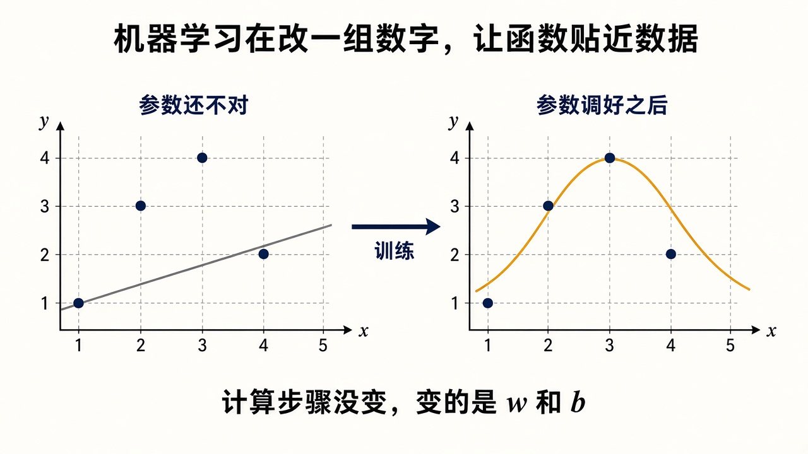
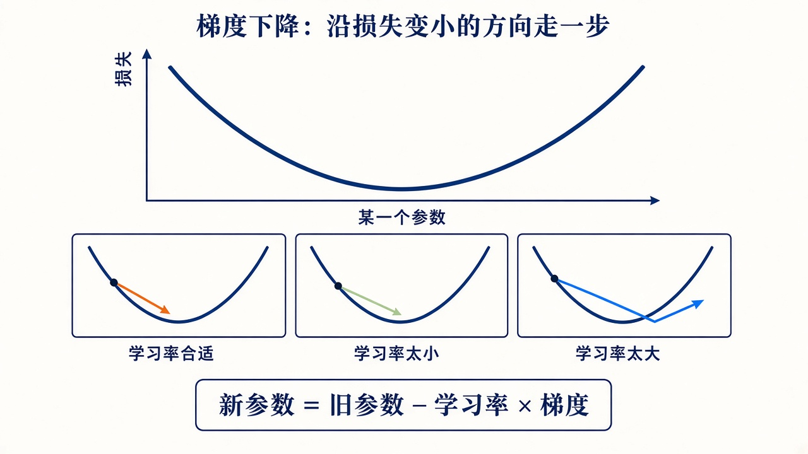
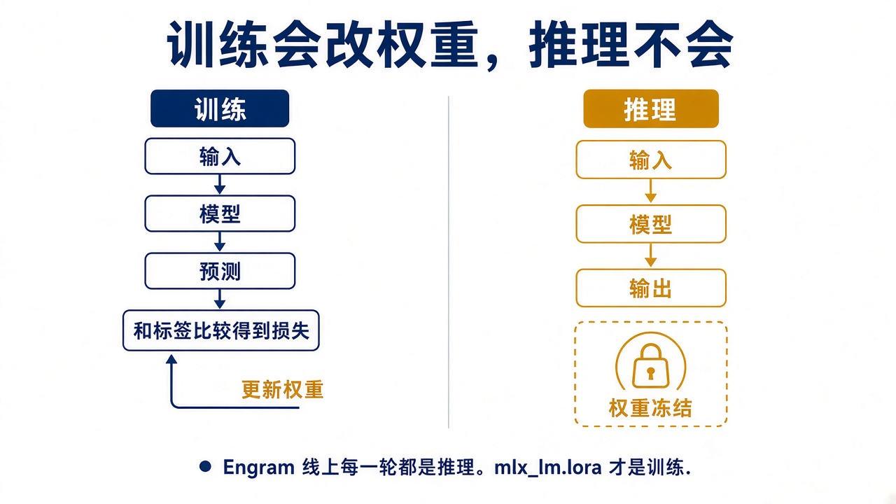
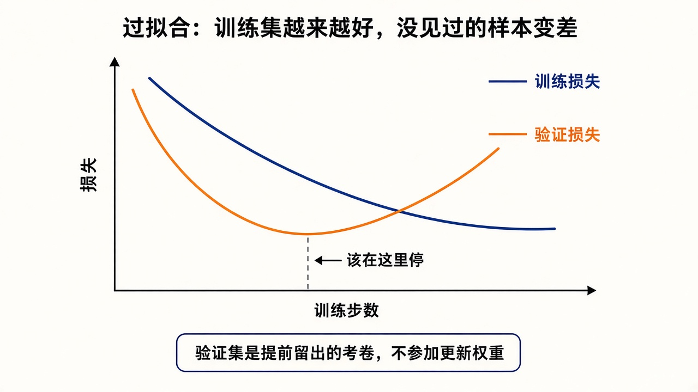

# 0. 机器学习在做什么

这一章不出现 Transformer，也不出现命令。它只建立后面每一章都要反复用的几个词：参数、样本、标签、损失、梯度、训练、推理、过拟合。

你写服务时，行为写在代码里。机器学习里，计算步骤先固定下来，行为由一大组数字决定。数字不同，同一个步骤的输出就不同。这些数字叫**参数**，也叫**权重**。训练就是改这些数字。模型就是「固定的计算步骤 + 当前这组数字」。

## 拟合

先看一个小到可以画出来的例子。平面上有几个点，你想要一条线或一条弯曲线尽量从它们旁边经过。直线可以写成 `y = wx + b`。`w` 和 `b` 就是全部参数。换一组 `w`、`b`，线就换一个斜率和截距。



左图的直线过不了中间拱起来的那些点。右图换成一条弯曲线之后，中间两个高点被贴住了。两端仍有缝。拟合是让整体更近，不是保证每个点都正好落在线上。计算步骤可以仍然是「用一条带参数的曲线去靠近这些点」，变的是参数。

聊天模型是同一个想法，只是参数有大约一百四十七亿个，输入是一段 token，输出是下一个 token 的概率。第 1 章再把这个函数写具体。

## 监督学习

一条**样本**是一对东西：

- **输入**：模型能看见的内容。小例子里是 `x`。聊天里是已经写好的前文。
- **标签**：希望模型预测出来的目标。小例子里是这个点的 `y`。聊天里是语料中真实写下的下一个 token。

模型读入输入，给出**预测**。预测和标签的差距就是**损失**。损失是一个数。差距大，损失大。训练的目标是把这个数变小。

这种「每个样本都带着正确答案」的学法叫**监督学习**。聊天模型的标签不是人在旁边打的分，而是文本里本来就有的下一个词。人把书和对话准备好，下一个词就已经写在里面。这仍然是监督学习。

后面会遇到三个集合，现在先把名字定下来：

| 名字 | 谁能看见它 | 用来干什么 |
|------|------------|------------|
| 训练集 | 训练过程 | 用它计算损失并更新参数 |
| 验证集 | 训练过程只读 | 看没参与更新的样本上，损失是不是也在下降 |
| 测试集或考题 | 训练结束之后 | 人按格式、出戏、事实这些标准打分 |

验证集要在开始改数据之前划出去。它如果和训练集是同一批句子，损失下降只说明模型记住了这几句。

## 梯度下降

参数有上百亿个，不能靠手调。**梯度**是每个参数上的一个数，表示「这个参数增大一点点，损失会上升还是下降，有多陡」。更新规则只有一句：

```text
新参数 = 旧参数 − 学习率 × 梯度
```

减去梯度，是往损失变小的方向走。**学习率**是这一步迈多大。



学习率合适，一步步靠近谷底。太小，方向对，但要走非常多步。太大，一步跨过谷底，损失反而跳动，严重时变成 NaN。第 9 章把第一轮学习率设成 `1e-4`，不稳定就改成 `1e-5`，改的就是这张图里的步长。

真实损失不是一条光滑的抛物线。一次只用一小**批**样本估计梯度，方向带噪声，所以日志里的损失会抖。抖着往下，是正常的。突然变成天文数字或 NaN，才是步长太大或数据坏了。

几个计数单位：

- **step**：用一批样本估一次梯度，更新一次参数。
- **batch size**：这一批里有几条样本。14B 在 48 GB 上设成 1。
- **epoch**：训练集里的样本大约都被看过一遍。8 条样本、batch size 为 1 时，一个 epoch 大约是 8 个 step。

## 训练和推理

**前向**是从输入算出预测。训练在前向之后还要算损失、算梯度、改参数。**推理**只有前向，参数保持不动。



Engram 线上每一轮聊天都是推理。用户多说一百句，权重文件也不会因此更新。`mlx_lm.lora` 才是训练。把这两件事混在一起，就会以为「多聊聊，模型就学会了这个用户」。聊天只是把文字放进当次的上下文。

**反向传播**是计算梯度的办法，用的是链式法则：损失先分给最后一层，再一层层往回传「这个参数该往哪边挪」。你不手写。需要记住的只有后果：某个参数如果被标成不接收梯度，它的数字就永远停在训练开始时的值。第 6 章冻结基座，就是这件事。

## 过拟合和泛化

**泛化**是指没见过的输入上，预测仍然像样。**过拟合**是训练集上的损失越来越好，验证集上反而变差：模型记住了这几条样本的特例。



图里该停的位置，是验证损失最低的附近，不是训练损失最低的时候。冒烟数据只有 8 条，多跑几百步几乎一定会走到这张图的右半边。那只证明管道能跑，不能证明角色学会了。

我们要的泛化，是一张没出现在训练集里的角色卡，模型也肯用 `*动作*` 加台词，并遵守卡里的边界。背下 Nera 的八句台词，过不了这个标准。

## 自问

1. 模型和一段普通代码相比，多出来的、会被训练改掉的是什么？
2. 验证集为什么不能拿去更新参数？
3. 学习率太大时，损失曲线通常会怎样？
4. Engram 里用户又发送了一句话，这一轮是训练还是推理？
