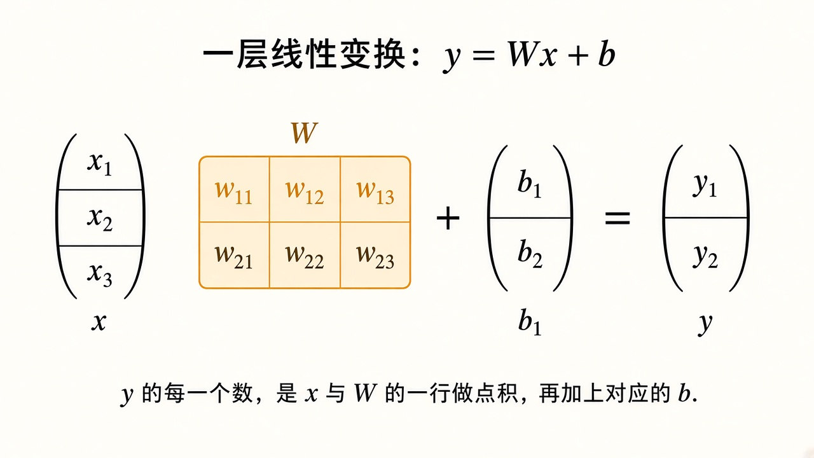
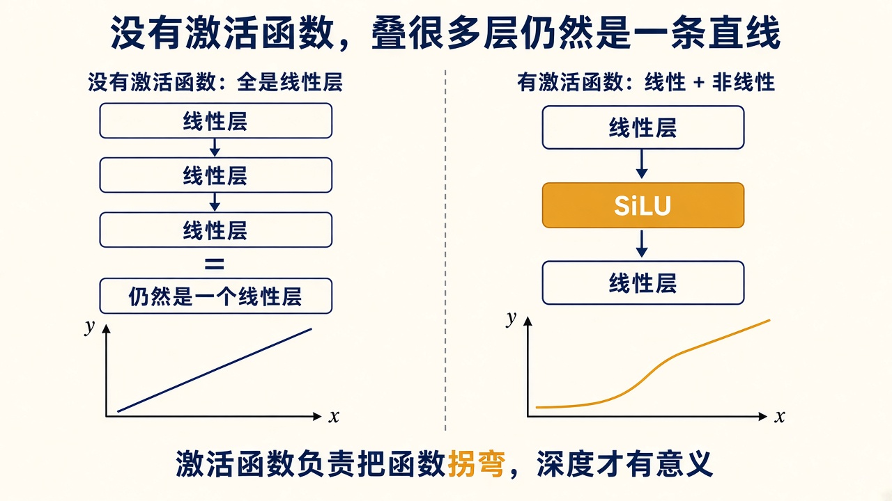
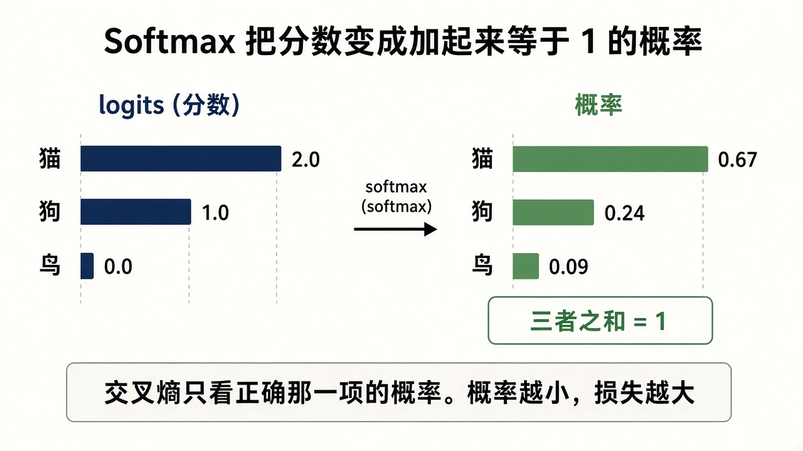
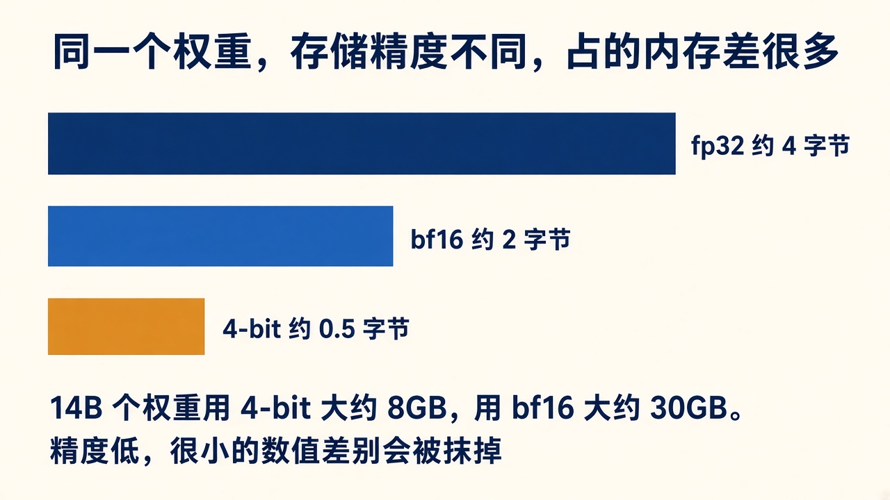

# 0b. 深度学习：把函数叠深

机器学习只说「有一组参数，用损失去改」。深度学习把这些参数排成很多层，一层的输出是下一层的输入。大语言模型是用深层网络做的语言模型。这一章把层、张量、激活函数、Softmax 和数值精度定下来。第 3 章的 Transformer 就是这些零件的一种具体接法。

## 张量

**标量**是一个数。**向量**是一列数。**矩阵**是一个长方形的数表。再往上叠，比如「一批样本，每条有若干 token，每个 token 有 5120 个数」，就是更高维的数组。这些在代码里都叫**张量**。你只要能读懂形状。

Qwen2.5-14B 里，一个 token 经过嵌入之后是长度 5120 的向量。一整段话是一个矩阵，行数是 token 个数，列数是 5120。5120 这个长度叫**隐藏维度**。它不是词的个数，是每个词被表示成多长的一串数。

## 线性层

网络里最常见的一块计算是：

```text
y = Wx + b
```

`x` 是输入向量，`W` 是权重矩阵，`b` 是**偏置**向量，`y` 是输出向量。Qwen 的注意力投影大多没有偏置，那就是 `b = 0`，只剩 `y = Wx`。



图从左到右是输入 `x`、矩阵 `W`、偏置 `b` 和结果 `y`。`W` 和 `x` 之间是乘法，不是把两张表相加。标题里的公式为准。

`y` 的每一个分量，是 `x` 和 `W` 的某一行做**点积**，再加 `b` 里对应的那个数。点积把两列同样长的数逐个相乘再相加。两列数的方向越接近，点积越大。第 3 章的注意力先算查询和键的点积，用这个大小决定「该看哪个 token 多少眼」。

`W` 的每一个数都是参数。一块 `5120 × 5120` 的矩阵就有约 2600 万个参数。14B 的大部分参数，就是几十块这样的矩阵。

## 为什么要有激活函数

如果每一层都只做 `Wx + b`，十层叠起来仍然可以用另一块矩阵一次算完。深度没有带来新的形状，函数还是直的。

**激活函数**是夹在线性层之间的逐个数变换，用来把函数拐弯。Qwen2.5 用的是 SiLU。它没有需要学习的参数，只是把每个数做一次固定的弯曲。负数被压下去，正数大体保留。ReLU 是更早的一种，负数直接变成 0。你不需要背公式。需要的判断是：没有这种弯曲，再多的层也只是一个线性层。



第 3 章的前馈网络就是「线性层，SiLU，再线性层」。注意力负责在 token 之间搬信息，前馈网络负责在每个位置上做这种弯曲变换。

## Softmax：分数变成概率

模型最后一层给出词表上的一排分数，叫 **logits**。分数可以是任意实数，可以是负数，加起来也不是 1。采样和交叉熵要的是概率。**Softmax** 做这件转换：每个分数先取指数，再除以全体指数的和。结果每一项都大于 0，全体加起来等于 1。



图里的三个数是四舍五入。`2.0`、`1.0`、`0.0` 的指数大约是 `7.39`、`2.72`、`1`，和大约是 `11.11`，所以概率大约是 `0.67`、`0.24`、`0.09`。分数最高的那一项，概率也最高，但其他项不会变成绝对的 0。

交叉熵只取正确 token 那一项的概率 `p`，损失是 `-log(p)`。概率从 0.67 掉到 0.09，损失会明显变大。第 5 章用的就是这个数。词表有 152064 项时，算法不变，只是分数从 3 个变成 152064 个。

## 前向和反向，对应到层

前向：嵌入 → 48 个 Transformer 层 → logits → Softmax → 和标签比出损失。

反向：从损失出发，算出每个允许更新的参数的梯度。一层的梯度要经过它后面所有层的计算才能得到，所以叫反向传播。

两条直接的后果：

- 最后几层离损失近，同样的数据下，梯度往往更直接。第一轮只训练最后 16 层，是在省内存的同时，先改最靠近输出的那些矩阵。
- 被冻结的矩阵参与前向，预测会用到它，但反向不给它写新值。QLoRA 的 4-bit 基座就是这样：它影响输出，训练不改它。

## 数值精度

每个参数在内存里要占固定的字节。字节越少，同样的 48 GB 放得下越大的模型，能表示的小数差别也越粗。



| 格式 | 一个数大约 | 约 147 亿参数 |
|------|------------|----------------|
| fp32 | 4 字节 | 约 59 GB，光权重就超过 48 GB |
| bf16 | 2 字节 | 约 30 GB |
| 4-bit | 0.5 字节 | 约 7 到 8 GB |

bf16 是脑浮点，用 16 位保存一个数，范围接近 fp32，小数精度更粗。4-bit 会把很接近的权重合到同一个格子里。这是 14B 能放进这台 Mac 的原因，也是第 10 章里「融合之后风格变淡」的原因：很小的 LoRA 增量，再量化一次可能被抹平。

训练时，冻结的基座用 4-bit，正在学习的 LoRA 矩阵用更高的精度。优化器还要为每个可训练参数另存几份状态。第 6 章把这本账算完。

## 这几个词和后面章节的接口

| 本章的词 | 后面出现在 |
|----------|------------|
| 权重矩阵 `W` | 第 3 章的 Q、K、V、O 和前馈；第 6 章的冻结 `W` |
| SiLU | 第 3 章前馈网络里的弯曲 |
| logits 和 Softmax | 第 1 章的概率柱；第 5 章的交叉熵 |
| 4-bit 和 bf16 | 第 6 章为什么不能全参数微调；第 10 章的融合 |
| 不接收梯度 | 第 6 章的 LoRA，只更新 `A` 和 `B` |

## 自问

1. 十个线性层中间如果不放激活函数，它和一个线性层有什么实质差别？
2. logits 为什么不能直接当成概率？
3. 一个参数用 4-bit 存储时，很接近的两个数会发生什么？
4. 冻结的基座还参与前向计算吗？
