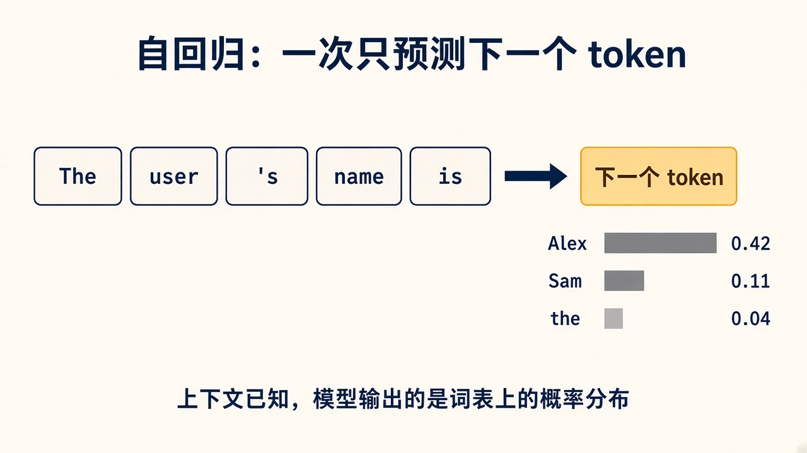

# 1. 模型在算什么

你平时调用的聊天模型，对外是一个函数：给它一组消息，它吐出一段文本。训练和推理内部都更窄。它每次只回答一个问题：

> 在已经看见的 token 后面，词表里每一个候选的概率是多少？

然后采样一个 token，把它接到上下文末尾，再问一次。整段回复是这个循环的产物。这叫自回归。

图里的柱子是词表上的一小截概率。真实词表有十几万项，大部分概率接近零。模型的输出是这一整张分布，采样器才决定吐出哪一个 token。

## 和 Agent 的分工

Engram 的 Harness 决定这一轮把什么放进上下文：角色卡、边界、记忆、摘要、最近对白。模型不拥有数据库，也看不见没放进来的历史。它只在给定上下文的条件下，给出下一个 token 的分布。

所以两件看起来像“模型没记住”的事，要分开：

- 上下文里根本没有那件事实。换模型也读不到。
- 上下文里有，分布却把概率给了别的说法。这才是模型行为。

检查器快照就是用来切开这两件事的。训练解决的是第二件，而且只在你的数据反复出现的那种第二件事上有效。

## 采样不是训练

温度、top-p 发生在训练结束之后。分布已经算完，采样器决定怎么从里面抽。

温度低于 1 时，高概率 token 更占优，回复更稳、也更容易重复。温度高于 1 时，长尾 token 更容易被抽到，回复更散。Engram 现在的 OpenRouter 请求没有另设温度，用的是服务端默认值。微调改变的是分布本身。采样只改变你从这张分布里怎么抽。

## 自问

1. 模型一次前向计算的直接产物是一段话，还是下一个 token 的分布？
2. 用户名只存在于记忆服务里、这一轮没被装进提示词时，微调能让模型说出这个名字吗？
3. 把温度调低，权重会变吗？
