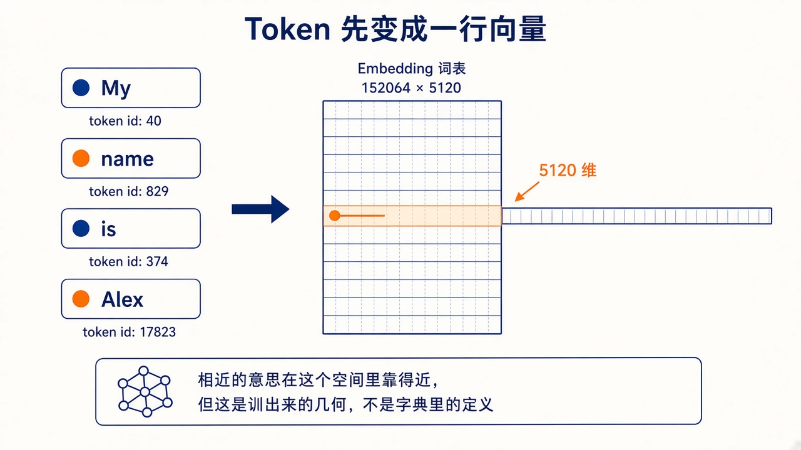

# 2. Token 与向量

模型不读字符。分词器先把字符串切成 token，每个 token 是词表里的一个整数。第 0b 章的向量，就是下面每个 token 查表之后得到的那一列数。

Qwen2.5-14B-Instruct 的词表大小是 152064。一个英文单词有时是一个 token，有时被切成几段。中文通常更碎，同样的意思会占更多位置，训练时的序列长度和显存都会更快顶到上限。

图里的 token id 是示意，不是这句英文在 Qwen 分词器里的真实编号。网格的 `152064 × 5120` 是真实的。5120 是这个模型的隐藏维度：每个 token 查嵌入表的一行，得到 5120 个数。嵌入表本身是一块要学习的参数，大约 `152064 × 5120 ≈ 7.79 亿` 个。Qwen2.5-14B 的 `tie_word_embeddings` 是 false，输出层还有一块同样大小的矩阵，把最后一层的向量投回词表。

## 分词器在合并什么

Qwen 用的是字节对编码一类的子词分词。它从字符出发，把语料里经常相邻的片段合并成一个新 token，直到词表达到固定大小。常见的英文单词往往整词占一个 id。少见的词、拼写变体和大部分中文会被切成更短的片段。

切分是确定的：同一版分词器对同一字符串永远给出同一串 id。它不是模型「读懂了再切」。模型只看见 id。两个在人看来同义的说法，如果切出来的 id 序列不同，对模型就是不同的输入，要靠权重去学它们该有相近的后续。

聊天模板还会插入控制 token，例如 `<|im_start|>` 和 `<|im_end|>`，用来标出 system、user、assistant 的边界。这些 id 同样占序列长度。`max_seq_length: 2048` 限制的是套完模板之后的总长度，不是你 JSON 里可见字符的长度。

## 向量里有什么

这 5120 个数不是人工规定的特征。训练把“经常出现在相似上下文里的 token”推到相近的方向。你可以把它想成一块可学习的查找表，表的几何形状是损失塑造的。

查找是精确的：id `17823` 永远取同一行，没有「找一个意思接近的行」这一步。相近发生在行里的数字上。两个 id 的行如果点积大，只能说明训练把它俩推到了相近的方向，不能说明词典里它们是同义词。专名、角色口癖经常是稀有片段，嵌入行主要靠你的微调样本去挪。样本里这个片段只出现一两次时，它的行几乎还是预训练留下的样子。

位置没有单独占一行。同一个 id 在句首和句尾取出的嵌入相同。Qwen2.5 用旋转位置编码（RoPE）：在算注意力之前，按位置把查询和键做旋转。两个位置差得越远，旋转角度差得越大，点积里就带上了相对距离。配置里的 `rope_theta` 是 1000000，它决定转得多快。`max_position_embeddings` 是 32768，这是基座预训练时准备好的位置范围。

微调时如果你把序列截在 2048，基座原有的长上下文能力还在权重里，但你的新数据没有专门教它在很长的角色卡后面怎么表现。截断若从左边切掉开头，角色卡会丢；若从右边切掉，最后一条 assistant 会丢，损失就学不到该学的回复。第 7 章因此要求超长时删旧回合、保留末尾回复。

## 和提示词预算的关系

Engram 的预算用 `ceil(字符数 / 4)` 估计 token。这是粗算。英文大致接近，中文会低估。本机训练把 `max_seq_length` 设为 2048 个真实 token。样本在送进训练器之前，要用同一套分词器量过，而不是只用字符数。

## 自问

1. 嵌入表的一行对应什么？
2. 为什么同一套中文对白比英文对白更吃序列长度？
3. 图里的 token id 能拿去和模型的输入对上吗？
