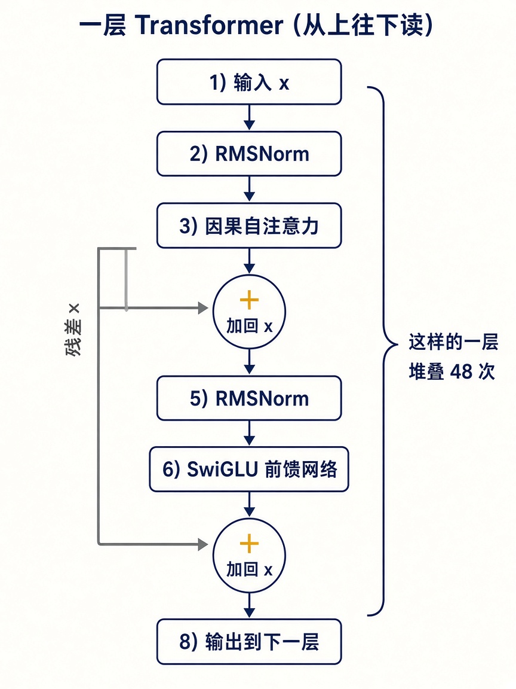
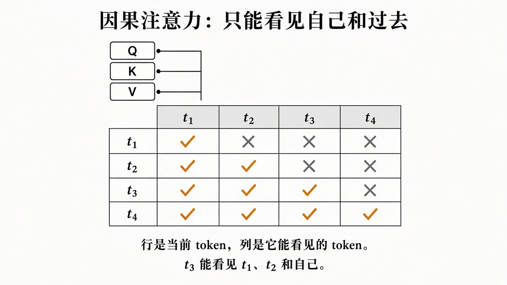

# 3. Transformer 里有什么

Qwen2.5-14B-Instruct 的配置是：48 层，隐藏维度 5120，40 个查询头，8 个键值头，头维度 128，前馈中间维 13824，激活是 SiLU。架构名是 `Qwen2ForCausalLM`。下面用这一组数字把参数对上账，避免“14B”停留在名字上。

第 0b 章的线性层 `y = Wx` 是这里每一块投影的形式。SiLU 是夹在前馈线性层之间的激活函数。注意力则是用点积决定每个 token 该看哪些位置。

## 一层里的顺序

一层先做注意力，再做前馈。两边都有残差：原来的向量一直留在一条干路上，子层只负责加上一份增量。



写成式子就是：

```text
x = x + Attention(RMSNorm(x))
x = x + SwiGLU(RMSNorm(x))
```

RMSNorm 把向量的尺度拉稳，本身参数很少，就是每个维度一个缩放。残差的意义很具体：深层网络如果只能整段重写 `x`，前面几层已经抽出的信息很容易被盖掉。加上残差之后，子层可以只修改需要改的方向。

48 层就是把这个方块堆 48 次。最后再过一次归一化，用输出矩阵投回 152064 维的词表 logits。logits 减去最大值再做 softmax，得到下一个 token 的概率。

## 因果注意力

注意力让当前位置去“查阅”别的位置。查询 Q、键 K、值 V 都是当前向量乘出来的三块线性投影。相关度来自 Q 和 K 的点积，取出来的内容是 V 的加权和。

生成是从左到右的，所以位置 t 不能看见 t 之后的 token。这靠一张下三角掩码实现，对角线保留，因为当前位置可以看见自己。



多头是把 5120 维拆开做几份注意力，再拼回去。Qwen2.5-14B 使用分组查询注意力：40 个查询头，8 个键值头。查询更细，键和值更省。省下来的主要是推理时的 KV cache，也就是已经算过的 K、V。训练要反传，省不掉那么多。KV cache 是推理结构，不是你这次要训练的对象。

## 前馈网络

注意力负责在 token 之间搬信息。前馈网络对每个位置单独做一次非线性变换，token 之间不再交换。SwiGLU 用三块矩阵：gate 和 up 把 5120 投到 13824，SiLU(gate) 和 up 相乘，down 再投回 5120。一个位置上的“知识”和措辞习惯，很大一部分坐在这些矩阵里。

## 参数账

一块线性层的参数量大约是输入维乘输出维。Qwen2.5 这些投影默认没有偏置，下面按无偏置估算。

一层注意力：

| 投影 | 形状 | 参数 |
|------|------|------|
| Q | 5120 × 5120 | 26,214,400 |
| K | 5120 × 1024 | 5,242,880 |
| V | 5120 × 1024 | 5,242,880 |
| O | 5120 × 5120 | 26,214,400 |

一层前馈：三块 `5120 × 13824`，合计 212,336,640。

一层合计约 2.75 亿。48 层约 132.1 亿。两块词表矩阵各约 7.79 亿。加起来约 147.7 亿。产品名叫 14B，配置摊开是这个量级。

这 147 亿个数字就是权重。微调如果要改它们全部，梯度和优化器状态会再复制几份。第 6 章用同一本账解释为什么 48 GB 只够训练其中的低秩增量。

## 自问

1. 一层里，注意力和前馈谁先执行？
2. 掩码矩阵里，t3 这一行哪些格子是允许的？
3. 14B 这个名字对应的参数，主要堆在层里的哪些矩阵上？
