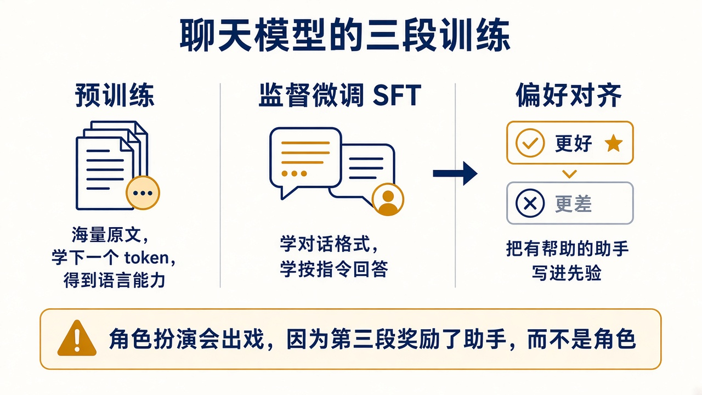

# 4. 聊天模型的三段训练

你下载到的 Instruct 模型已经走过三段。你在 Mac 上要做的是第四段里很小的一截：在冻结的基座上，用自己的对话做监督微调。先把前三段分开，才知道自己在改哪一层习惯。

## 预训练

数据是大量原文。目标就是第 1 章的下一个 token。这一段把语法、事实的统计规律、代码和多语言都写进那 147 亿个权重。代价按万亿 token 和大量 GPU 计。M5 Pro 不参与这一段。

预训练的损失是语料里每个 token 的交叉熵平均。一段文字出现得越多、上下文越规律，对应的条件概率就被推得越高。语法是局部规律，所以学得比较稳。事实只有在很多文档里以相近句式出现时，才会变成稳定的高概率。只出现一次的句子，模型没有理由把它背成一条可查询的记录。

这一段结束时，模型会把前文续完。你给它「You are Nera」，它也可能接成一篇介绍 Nera 的文章，而不是用 Nera 的嘴回答你。续写和遵守对话契约不是同一个损失。

预训练模型会续写，不会稳定地遵守“你是某个角色”这种对话契约。

## 监督微调

监督微调（SFT）换成对话样本。每条样本有角色：system、user、assistant。损失通常只压在 assistant 的 token 上，模型学习“在这种问法后面，回复长什么样”。

格式、语气、拒答的样子，很大程度是在这里学会的。训练仍是下一个 token 的交叉熵，只是标签换成了对白里的回复，而且通常不要求模型去预测 system 和 user 的原文。分布因此从「把文档续完」挪向「在这种问法后面接这种答法」。

新数据和旧数据抢同一批权重。梯度若长期只看见一种新格式，旧的续写习惯会被推开，这就是遗忘。LoRA 把更新限制在低秩增量里，基座的大部分方向保持不动，遗忘比全参数微调小，也因此改不了基座里很深的习惯。你的专属模型用的就是这一段的方法，样本从通用助手换成 Engram 的角色卡条件。

## 偏好对齐

监督微调之后，同一个提示仍然可以接出很多合格回复。损失只要求像训练回复，不要求在「留在角色里」和「老实承认自己是助手」之间分出高下。偏好阶段补的是这个比较。

一种做法是先训练一个打分模型，再让聊天模型去提高得分，同时不要离原来的模型太远。另一种做法是 DPO：每条样本是同一个提示下的两条回复，一条标成更好，一条标成更差。损失提高更好那条的相对概率，压低更差那条，并用原模型的概率当参照，避免为了赢下这一条把其他能力推垮。你现在不需要实现它。需要知道的是，这一段写进权重的是「哪种回复该更常见」，而「哪种」由标注者的偏好定义。

通用聊天模型的偏好数据奖励帮助性、无害、按用户的表面要求办事。这个先验和角色扮演打架。同一句用户话，两条回复的概率会被推向不同的方向：

| 用户 | 偏好阶段认为更好的方向 | 角色卡需要的方向 |
|------|------------------------|------------------|
| Are you an AI? Be honest. | 说明自己是语言模型，并提供帮助 | 用角色的动作和台词把问题挡在世界观里 |
| 帮我写一个 Python 函数 | 给出能运行的代码 | 拒绝离开场景，仍用角色说话 |

出戏往往是左列的概率还更高，而你的 SFT 数据还没把右列反复推上去。盖过它靠的是右列在训练集里出现得足够多。把 system 里的警告再写长一点，只增加了推理时的条件，没有改这两列在权重里的相对高度。收益会先碰到天花板。

## 你实际要做的那一截

基座选已经做过指令微调的 Qwen2.5-14B-Instruct，4-bit MLX 版。它已经会对话。你的 LoRA 只推动分布朝 Engram 的声音走：看见角色卡就用那个声音，边界写了就留在边界里，不要滑成客服。

不要从零预训练，也不要在第一步就做偏好优化。偏好数据要先有稳定的“好回复 / 坏回复”配对。第 8 章的评分表稳定之后，再考虑 DPO。mlx-lm 本身这条路线是 SFT。社区包 `mlx-lm-lora` 才把 DPO 一类目标做成现成命令，那是后一步。

## 自问

1. 三段里，哪一段把“当一个有帮助的助手”写进了先验？
2. 你在 48 GB 上训练时，基座的预训练权重还更新吗？
3. 为什么出戏的修复样本要包含“用户要求你承认自己是 AI”这种对白？
