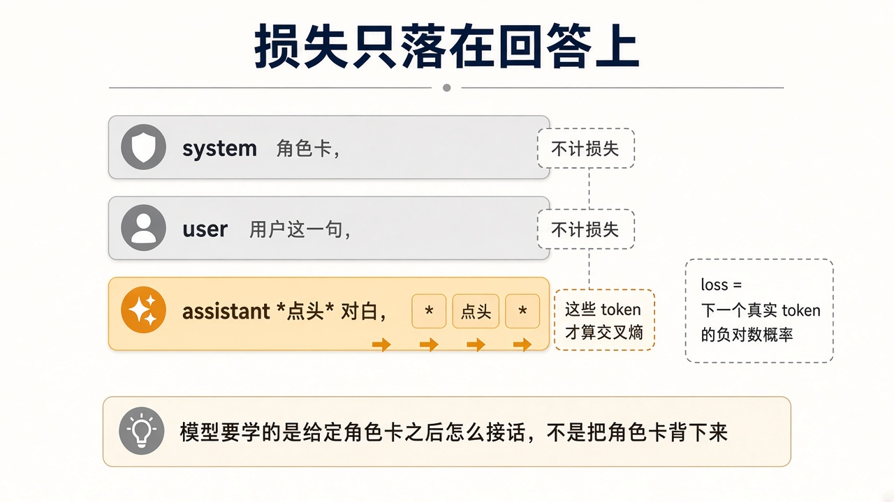

# 5. 损失与梯度

第 0 章已经把损失定义成「预测和标签的差距」，更新写成 `新参数 = 旧参数 − 学习率 × 梯度`。这一章把差距具体写成下一个 token 的交叉熵，并说明哪些 token 算进这个差距。训练循环仍是三件事：前向算出每个位置的分布，用标准答案算一个分数，再按梯度更新允许训练的参数。你不手写反向传播，MLX 会做。你要会读损失在告诉你什么。

## 交叉熵

某个位置的标准答案是 token `y`。模型给它的概率是 `p`。这一位置的损失是 `-log(p)`。

概率是 1 时，损失是 0。概率是 0.1 时，损失大约是 2.3。概率越接近 0，损失越大。一整条回复的损失是这些位置的平均。

训练就是让真实写下的下一个 token 拿到更高的概率。它不会另有一个“角色一致性”按钮。角色一致性只有写进样本里，才会变成这些 token 的概率。

## 蒙版

如果 system 和 user 的 token 也算损失，模型会花容量去背角色卡和用户原话。背下来的是字面，不是“给定角色卡之后怎么接”。

`--mask-prompt` 让损失只落在补全段。对 mlx-lm 的 chat 格式，补全段是消息列表里的最后一条。因此每条训练样本都以 assistant 回复结尾。更早的 assistant 回合算在提示里，不产生损失。

这和线上一致。Engram 每次只让模型生成最新一条回复，历史里的旧回复已经落在会话里。把长对话切成“历史 + 这一条回复”，一条样本教一个回合。

## 步、批、学习率

一个 step 用一小批样本估计损失的梯度，再按学习率走一步。

- `batch_size: 1`：一次只放一条序列。14B 在 48 GB 上用这个值。
- `grad_accumulation_steps`：攒多步梯度再更新。显存不变，等效批变大。第一轮设 1。
- `learning_rate`：步长。LoRA 常用 `1e-4`。mlx-lm 自带示例用 `1e-5`，更稳也更慢。损失来回跳就降到 `1e-5`。
- `iters`：更新次数。数据会被重复抽取。8 条样本跑 800 次，就是在同一小撮对白上走很多遍。

一个 epoch 大约是“每条训练样本被看到一次”。冒烟数据 8 条、batch 1，一个 epoch 就是大约 8 次迭代。真实数据有 2000 条时，先把 `iters` 设在 2000 附近，看验证损失，再决定要不要第二遍。

## 损失下降不等于角色更好

训练损失下降，表示模型更能背出训练集里的回复。验证损失跟着降，表示没见过的样本也更可预测。验证损失上升而训练损失继续降，是过拟合：它在背那几百条对白。曲线长这样：

即便两个损失都健康，仍要用人读回复。损失不区分“漂亮地出戏”和“正确地留在角色里”。第 8 章的表才区分。

## 自问

1. 概率从 0.5 变成 0.9，这一位置的 `-log(p)` 会怎样？
2. 为什么一条多轮样本如果只在最后一条 assistant 上训练，更早的回复该放在哪里？
3. 训练损失降到很低，验证损失升高，下一步应该加迭代还是停？
