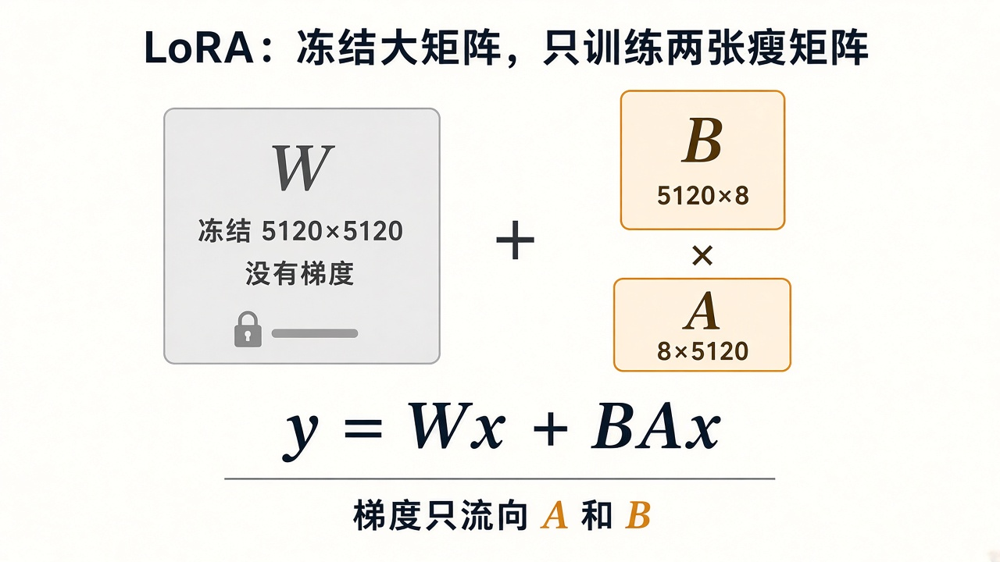
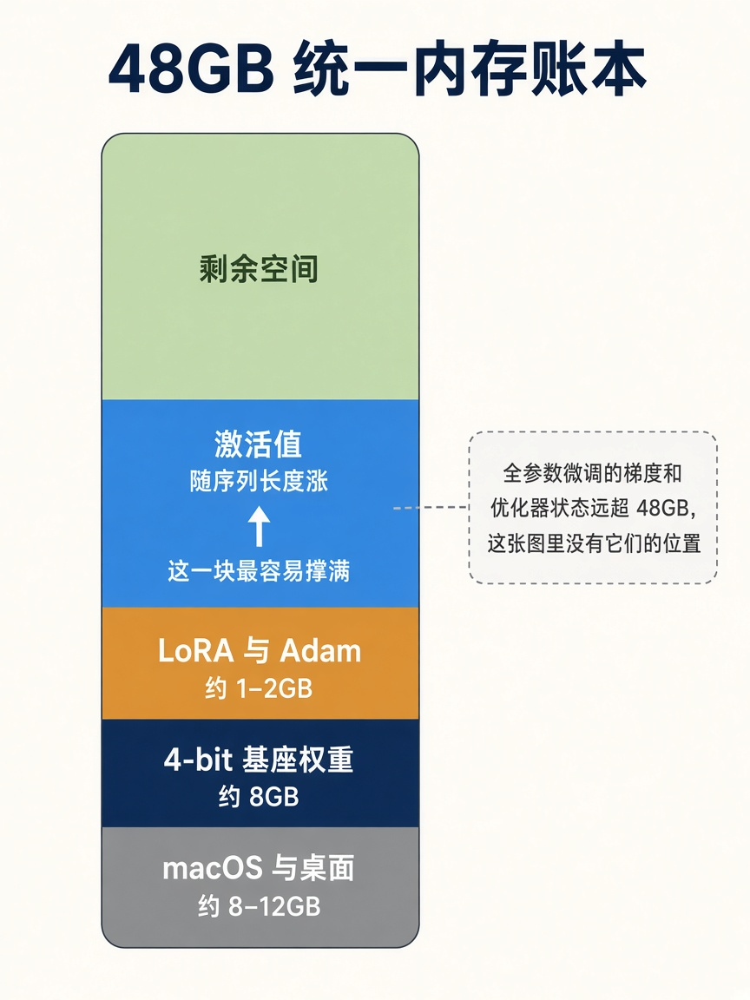

# 6. LoRA 与 QLoRA

全参数微调要动第 3 章那约 147 亿个数。优化器还要为每个数保存动量和二阶矩。用 bfloat16 权重和梯度、fp32 的 Adam 状态粗算：

| 份 | 字节 | 大约占用 |
|----|------|----------|
| 权重 bf16 | 2 | 30 GB |
| 梯度 bf16 | 2 | 30 GB |
| Adam 两个状态 fp32 | 8 | 118 GB |

还没算激活值，已经超过 170 GB。48 GB 的统一内存里没有这一档。所以这台 Mac 上的路线是 QLoRA：基座量化后冻结，只训练旁边的低秩矩阵。

## LoRA 在改什么

一块冻结的大矩阵记为 `W`。LoRA 不保存一份新的 `W`，只加两张瘦矩阵。秩 `r = 8` 时，对 5120 维的投影：

- `A` 是 `8 × 5120`
- `B` 是 `5120 × 8`

前向变成 `y = Wx + BAx`。`BA` 的结果形状仍是 `5120 × 5120`，但它的自由度只有 `2 × 5120 × 8 = 81920`，而不是 2600 万。

梯度只流向 `A` 和 `B`。`W` 在磁盘上的 4-bit 数值不动。

第一轮只给最后 16 层的 `q_proj` 和 `v_proj` 加 LoRA。可训练参数大约 `16 × 2 × 81920 ≈ 260 万`。相对 147 亿，这是一条很窄的修正。它足够推动语气和格式，不够重写基座的全部知识。内存还有余、声音仍弱时，再把 `num_layers` 提到 48。不要第一轮就把 MLP 的三块投影都打开。

`scale` 是 MLX 乘在这份低秩输出上的系数。上游示例把 rank 8 和 scale 20 配在一起。第一轮保持这对组合。只把 rank 加大、scale 不动，更新的幅度会一起变，结果很难和上一轮比较。

## 4-bit 基座占多少

14.8e9 个权重如果每个 4 bit，大约 7.4 GB，加上量化用的缩放系数，按 8 GB 准备。这就是 QLoRA 和普通 LoRA 的差别：普通 LoRA 的 `W` 仍是 bf16，光基座就要约 30 GB，再加激活，48 GB 会很紧。指向一个 4-bit 的 MLX 模型时，mlx-lm 走 QLoRA。指向未量化模型时，它走普通 LoRA。

图里的分区是数量级，给第一轮留的余量：

- 系统和桌面大约 8–12 GB。训练时退出浏览器和多余的 Electron 应用。
- 4-bit 权重大约 8 GB。
- 这一轮的 LoRA 加 Adam 远小于 1 GB。图上的 1–2 GB 是以后把层数和投影加宽时的余量。
- 激活值随序列长度涨，是会把剩余空间吃完的那一块。`batch_size` 保持 1，`max_seq_length` 保持 2048，并打开 `grad_checkpoint`。梯度检查点用重算换内存，速度会降，第一轮用它换一次能跑完的实验。

活动监视器里内存压力保持绿色，再考虑关掉检查点或把序列放到 4096。

## 什么不要训进权重

用户的名字、承诺、剧情进度会变，也按人不同。它们继续由 Memory 和 Conversation 放进提示词。权重里要有的是：看见 `[What you remember about the user and story]` 这种块时，回复去用它，而不是忽略它。样本里要出现“记忆块里写了名字，回复使用这个名字”。模型学的是服从这块文本的习惯。

## 自问

1. 全参数微调的 Adam 状态大约是多少 GB？
2. `y = Wx + BAx` 里，哪些符号有梯度？
3. 把基座从 4-bit 换成 bf16，训练类型会变成什么？
