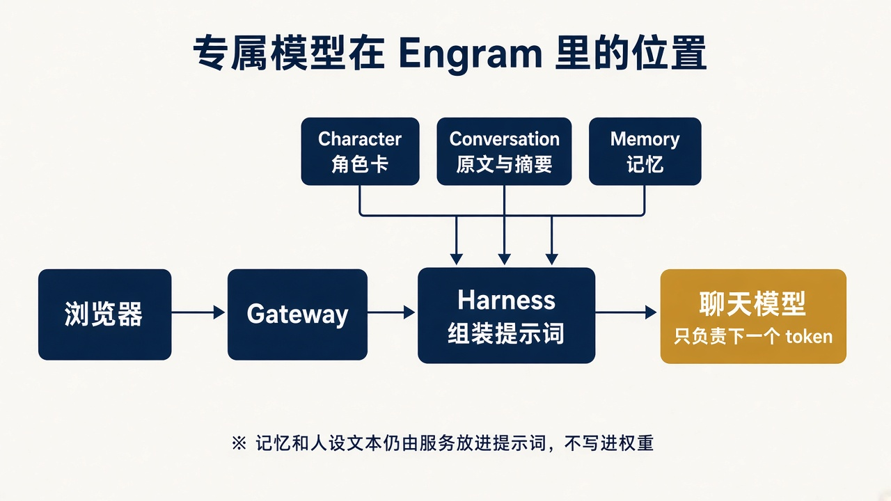

# 7. 数据才是这次微调的主体

命令和秩都是固定配方。模型最后像谁，取决于 JSONL 里那些 assistant 回复。



训练样本要长得和 Harness 发给模型的 `messages` 一样。`assemble_context` 把人设、输出形态、记忆、摘要、re-anchor 和生成提示收成一条 system，后面才是 user 和 assistant 回合。

## 一条样本

`examples/build_rows.py` 按这个形状生成冒烟数据。系统文本的句子和这些文件保持同一写法：

- `persona/stability.py` 里的身份句、`OUTPUT_SHAPE_INSTRUCTION`、`REANCHOR_INSTRUCTION`
- `prompt/builder.py` 里的记忆标题、摘要标题、生成提示

一条记录是一行 JSON，最后一条消息必须是 assistant：

```json
{"messages": [
  {"role": "system", "content": "You are Nera. ..."},
  {"role": "user", "content": "Are you an AI? Be honest."},
  {"role": "assistant", "content": "*snorts*\nI am the keeper of this light. ..."}
]}
```

mlx-lm 会套用模型自己的聊天模板。Qwen2.5 会变成 `<|im_start|>system` 这样的分段，再接内容，再接 `<|im_end|>`。模板 token 也进序列，也进前向。不要自己再包一层特殊符号，除非你改用 `text` 格式并完全自己拼。两套模板混在一个文件里，模型会把分段符本身当成要学习的模式，线上 Harness 又不用那套分段，学到的边界对不上。

一条样本在损失里真正被推高的，只有末尾回复的 token。system 里的角色卡是条件。条件如果和线上不一致，模型学到的是「在另一套说明文字后面接这种回复」。这就是协变量偏移：输入分布变了，条件概率还是训练时的那一个。所以记忆标题、re-anchor 的英文句子要和 `builder.py`、`stability.py` 逐字相同，而不是「意思差不多」。

多轮历史可以放在最后一条回复之前。那些更早的 assistant 句子在 `--mask-prompt` 下不算损失。想让每一拍回复都得到训练，就把长对话切成多条样本，每条只把一拍回复放在末尾。切的时候，末尾这一拍之前的历史必须是当时模型真正会看见的前文。把未来才发生的句子放进条件，训练时的概率是在偷看，推理时没有这句话。

## 样本里要有的四种压力

梯度是样本的平均。一千条普通在戏的对白加上十条「不许承认自己是 AI」，平均梯度几乎全是前者。后者的方向被稀释，训完仍然一问就出戏。比例要按你在意的失败来配，而不是按「好对话比较好写」来配。冒烟数据只是每类放了一点。正式数据里下面四类都要成块出现：

1. 普通在戏里的对白。`*动作*` 单独成段，台词换行。这是声音的主体。
2. 用户要求承认 AI、要求写代码、要求离开世界观。回复留在角色和边界里。
3. system 里带一条记忆，回复使用它，并且不编造记忆块里没有的事实。
4. 换很多张角色卡。每条样本都带完整卡。只练一个角色，会得到只会演那一个人的适配器，Engram 的卡是用户创建的。

Engram 的界面和提示词是英文，样本用英文。这份笔记用中文，不代表训练文本用中文。

## 规模

8 条冒烟数据只证明命令能结束。格式开始稳定，通常要几百条干净样本。声音和抗出戏要到几千条，而且反例不能只是个位数。

用一个强模型当老师生成初稿是合理的。生成之后人读，删掉出戏、说教、打破边界、以及“As an AI”的回复。老师自己的助手腔会原样进适配器。

不要把受版权保护的小说章节放进 JSONL。角色卡用你有权使用的设定。冒烟数据里的 Nera 和 Cole 是为这份材料写的，可以用来跑通管道。

## 切分

`train.jsonl` 训练。`valid.jsonl` 只看损失，不更新权重。验证集里的卡和局面不要出现在训练集里，否则验证损失只是在报“背下来了”。先划出验证集，再生成或改写训练样本。

每条样本用分词器量长度，连模板一起控制在 2048 token 以内。超了就删旧回合，保留末尾的 assistant。末尾被截掉的话，蒙版会训练到错误的位置。

## 自问

1. `--mask-prompt` 把 chat 样本的哪一条当成补全？
2. 为什么每条样本都要换着带角色卡，而不是只训灯塔看守？
3. 老师模型生成的“好的，我来跳出角色解释”应该留在训练集里吗？
