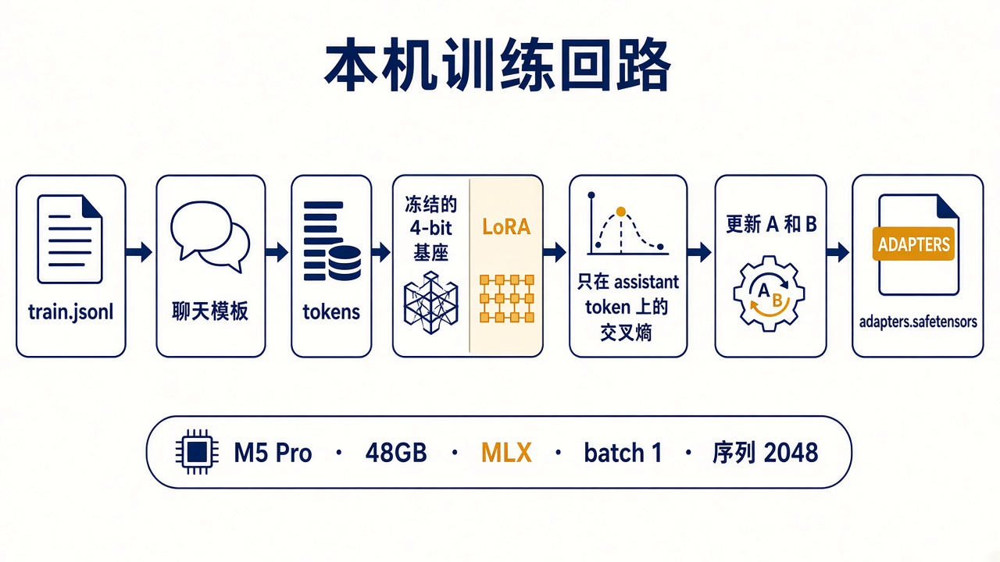

# 9. 在 M5 Pro 上跑通

这一章在你的 Mac 上执行。云端 Linux 没有 Apple GPU，MLX 训练不会在那边跑。下面的命令对到 mlx-lm 文档里的 `mlx_lm.lora`，配置键对到上游的 `examples/lora_config.yaml`。



## 基座

使用 `mlx-community/Qwen2.5-14B-Instruct-4bit`。

- 上游是 `Qwen/Qwen2.5-14B-Instruct`，许可证 Apache-2.0，允许微调。仓库页以 Hugging Face 上的 LICENSE 为准。
- 它是 4-bit MLX 权重。`mlx_lm.lora` 见到量化模型就走 QLoRA。
- mlx-lm 的 LoRA 说明列出了 Qwen2 系列。Qwen2.5 用的是这套结构。
- 以后若要换成更新的 14B，先确认 mlx-lm 的支持列表里有那个架构，并且许可证允许微调。不要为了追新模型改掉数据格式。

下载大约 8 GB。磁盘留出 30 GB，融合后的模型还会再占一份。

## 环境

用一套独立的虚拟环境，不要装进 Engram 仓库的 `.venv`。MLX 和项目依赖没有必要锁在一起。

```bash
python3 -m venv ~/.venvs/engram-mlx
source ~/.venvs/engram-mlx/bin/activate
python -m pip install -U pip
python -m pip install "mlx-lm[train]"
```

确认命令存在：

```bash
mlx_lm.lora --help
```

帮助里应能看到 `--mask-prompt`、`--batch-size`、`--num-layers`、`--grad-checkpoint`。看不到就说明装到的不是带训练额外依赖的 mlx-lm，先停，不要自己改命令名。

插上电源。合盖睡眠会中断训练。第一轮把浏览器关掉。

## 冒烟数据

在 Engram 仓库根目录：

```bash
python docs/model-training/examples/build_rows.py
```

这会重写 `examples/train.jsonl`（8 行）和 `examples/valid.jsonl`（2 行）。配置在 `examples/lora.yaml`：batch 1，迭代次数 8，序列 2048，最后 16 层的 Q 和 V，rank 8，scale 20，学习率 `1e-4`，梯度检查点打开。适配器写到仓库外的相对路径 `adapters/engram-smoke`。这个目录不要提交。

蒙版通过命令行打开，因为上游示例 YAML 没有这个键，而命令行会覆盖配置：

```bash
mlx_lm.lora --config docs/model-training/examples/lora.yaml --mask-prompt
```

正常的话，几分钟内能看到训练损失和一次验证损失，并在 `adapters/engram-smoke` 里得到 `adapters.safetensors`。这一轮的损失没有意义，样本只有 8 条。它只证明：模型下得来，内存没有被系统杀掉，适配器写得出来。

活动监视器里如果内存压力变红、进程被杀，先确认没有第二个大模型占用统一内存，再把 `num_layers` 降到 8。不要先去关量化。

## 用适配器说一句话

```bash
mlx_lm.generate \
  --model mlx-community/Qwen2.5-14B-Instruct-4bit \
  --adapter-path adapters/engram-smoke \
  --max-tokens 120 \
  --prompt "Say hello as a lighthouse keeper in one short line."
```

`generate` 的 `--prompt` 不走你的 JSONL 模板，所以这句话只是管道检查。真正的对比用第 8 章的考题，把 system 和 user 按聊天方式送进去。mlx-lm 若提供对 chat 文件的测试命令，用：

```bash
mlx_lm.lora \
  --model mlx-community/Qwen2.5-14B-Instruct-4bit \
  --adapter-path adapters/engram-smoke \
  --data docs/model-training/examples \
  --test
```

这报告的是困惑度，不是五项评分。两项都要留。

## 换成正式数据

1. 按第 8 章写好考题，并跑一遍未微调的基座，把分数记下来。
2. 建一个仓库外的目录，例如 `~/engram-tune/data`，放入你自己的 `train.jsonl` 和 `valid.jsonl`。
3. 复制 `lora.yaml` 到 `~/engram-tune/lora.yaml`，把 `data` 指到那个目录，把 `iters` 设成训练行数（一个 epoch），`adapter_path` 设成 `~/engram-tune/adapters/run1`，`steps_per_report` 设成 10，`steps_per_eval` 设成 100。
4. 同样带 `--mask-prompt` 启动。
5. 验证损失开始高于上一轮记录时停。用第 8 章的表打分。分数没有超过基座，就改数据，不要把 `iters` 再乘十。

几千条、每条一两千 token 的一个 epoch，在这台机器上是数小时、插电过夜的规模。具体每秒 token 数以你第一次冒烟时日志里的数字为准，不要用别人机器上的速度做计划。

## 自问

1. 为什么训练环境不装进 Engram 的 `.venv`？
2. 冒烟跑完，损失很低，能说明 Nera 的声音已经学会了吗？
3. 正式运行的 `iters` 第一轮为什么接近训练行数？
